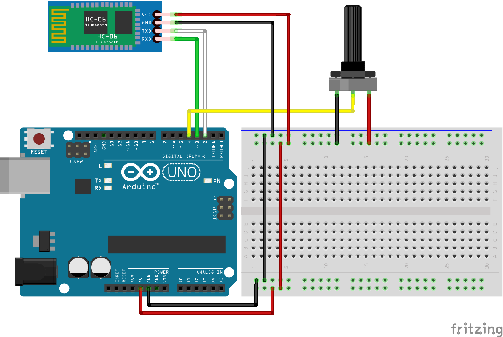

# 점화 콕 손잡이

#### 지원 기능
- 단수(스위치) 변경시 자동으로 변경 값 블루투스 송신.
- 단수(스위치) 변경시 1초이내 원래 값으로 돌아올 시 블루투스 송신 하지않음.
- 블루투스를 통해 원하는 정보 요청시 응답.

#### 사용된 부품
|부품   |역할|규격(mm)|필수|수량|링크|
|---|---|---|---|---|---|
|hc-05|무선 통신|37 x 17 x 5|y|1|[구매](https://www.coupang.com/vp/products/248838944?itemId=787322013&isAddedCart=)|
|arduino nano|제어|45 x 19 x 19|y|1|[구매](https://www.coupang.com/vp/products/23992271?itemId=93366956&isAddedCart=)|
|mpu6050|센서|21 x 11 x 7.5|y|1|[구매](https://www.coupang.com/vp/products/5016114191?itemId=6721993893&isAddedCart=)|

#### 회로도

#### 핀 연결 정보
|선 색깔|아두이노|hc-05|mpu6050|
|----|---|---|---|
|빨강|5v|Vcc|Vcc|
|검정|GND|GND|GND|
|흰색|3|RXD|    |
|갈색|2|TXD|    |
|노랑|A5|    |SCL|
|보라|A4|    |SDA|

#### 실행
- 단수 조절시 자동전송   
