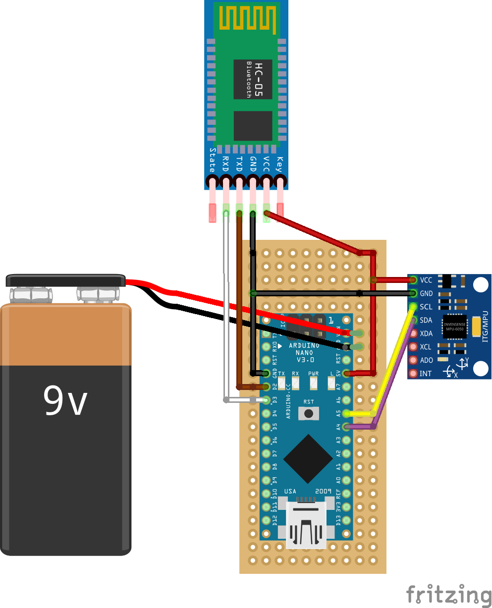

# 점화 콕 손잡이

#### 지원할 기능
- 현재 몇 단인지 인식.
- 블루투스 연결 지원.

#### 사용된 부품
|부품   |역할|규격(mm)|필수|수량|링크|
|---|---|---|---|---|---|
|hc-06|무선 통신|37 x 17 x 5|y|1|[구매](https://www.coupang.com/vp/products/5767993544?itemId=9790717522&isAddedCart=)|
|arduino uno|제어|69 x 53 x 12|y|1|[구매](https://www.coupang.com/vp/products/84959309?itemId=964056709&isAddedCart=)|
|FSR-16|버너 손잡이용|10 x 10 x 17.6|y|1|[구매](https://www.icbanq.com/P007628094)|

#### 회로도

#### 핀 연결 정보
|선 색깔|아두이노|I2C LCD|hc-06|HX-711|버튼|
|----|---|---|---|---|---|
|빨강|5v|Vcc|Vcc|Vcc|    |
|검정|GND|GND|GND|GND|2|
|노랑|6, 7|    |    |    |3|
|초록|3|    |RXD|    |    |
|회색|A5|SCL|    |    |    |
|주황|A4|SDA|    |    |    |