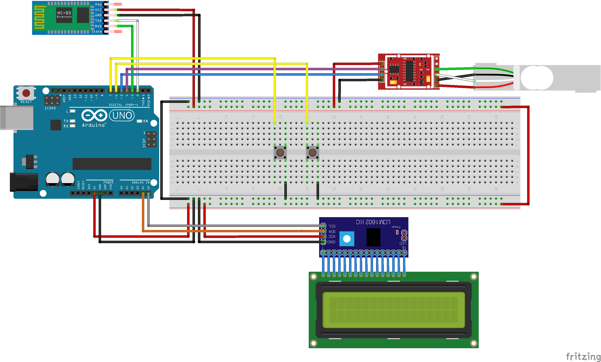

# 전자 저울

#### 지원할 기능
- 5kg 까지 측정 가능.
- 블루투스 연결 지원.
- LCD로 현재 상태 표시.

#### 사용된 부품
|부품   |역할|규격(mm)|필수|수량|링크|
|---|---|---|---|---|---|
|HX-711|센서 보정|34 x 21 x 3|y|1|[구매](https://www.coupang.com/vp/products/5123229588?itemId=7004937339&isAddedCart=)|
|4선식 로드셀 무게 센서|전자 저울|80 x 12.7 x 12.7|y|1| [구매](https://www.coupang.com/vp/products/1370338636?itemId=2402833361&isAddedCart=)|
|hc-06|무선 통신|37 x 17 x 5|y|1|[구매](https://www.coupang.com/vp/products/5767993544?itemId=9790717522&isAddedCart=)|
|arduino uno|제어|69 x 53 x 12|y|1|[구매](https://www.coupang.com/vp/products/84959309?itemId=964056709&isAddedCart=)|
|LCD 1602 IIC/I2C|화면|82 x 35 x 18|y|1|[구매](https://www.coupang.com/vp/products/316031012?itemId=1004961547&isAddedCart=)|
|push button|버튼|6 x 6 x 5|y|2|[구매](https://www.coupang.com/vp/products/5763813992?itemId=9769915495&isAddedCart=)|

\* 로드셀 [키트](https://www.coupang.com/vp/products/1370331139?vendorItemId=70397665972&isAddedCart=)를 살경우 hc-06을 제외한 부품을 사지 않아도 됨. 

> 회로도 

#### 핀 연결 정보
|선 색깔|아두이노|I2C LCD|hc-06|HX-711|버튼|
|----|---|---|---|---|---|
|빨강|5v|Vcc|Vcc|Vcc|    |
|검정|GND|GND|GND|GND|2|
|노랑|6, 7|    |    |    |3|
|초록|3|    |RXD|    |    |
|흰색|2|    |TXD|    |    |
|보라|4|    |    |CK/TX|    |    
|파랑|5|    |    |DO/RX|    |
|회색|A5|SCL|    |    |    |
|주황|A4|SDA|    |    |    |

\* 로드셀과 HX-711 사이의 [연결](https://codeh.tistory.com/150)은 로드셀 제조회사에 따라 다름.   
\* 회로도에서 LCD와 LCM1602 사이의 연결된 모습은 LCD 1602 IIC/I2C의 회로도로 상관하지 않아도 됨.